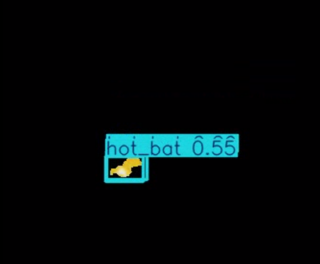
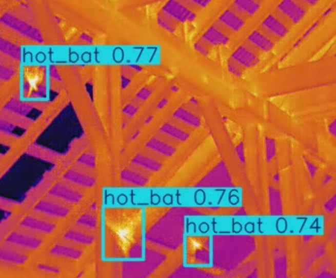

# HeatSeek

**HeatSeek** is a command-line tool for downloading thermal datasets, preprocessing video, training YOLO models, and tracking objects in thermal imagery. The current focus of the package is on thermal imagery of bats.

<p align="center">
  
  
</p>

## Installation

First, clone the repository:

```bash
git clone ...
cd heatseek
```

Then install the package:

```bash
pip install . --no-build-isolation
```

Alternatively, for development:

```bash
pip install -e . --no-build-isolation
```

---

## Usage

### Download Weights if Necassary

```bash
heatseek train \
  --data-yaml path/to/data.yaml \
  --weights yolov8s.pt \
  --epochs 400 \
  --batch 16 \
  --imgsz 640
```
### Download dataset from RoboFlow

```bash
heatseek  download   --api-key API_KEY   --workspace WORKSPACE  --project PROJECT_NAME   --version VERSION_NUM   --nc CLASS_NUM   --names CLASS_NAME
```

### Train YOLO Model

```bash
heatseek train \
  --data-yaml path/to/data.yaml \
  --weights yolov11s.pt \
  --epochs 400 \
  --batch 16 \
  --imgsz 640
```

---

### Preprocess Thermal Video

```bash
heatseek preprocess \
  --input raw_video.mp4 \
  --output bg_reduced.mp4 \
  --thresh 3.0
```

Removes background using thermal contrast thresholding.

---

### Track Objects

```bash
heatseek track \
  --input video.mp4 \
  --output tracks.json \
  --weights yolov8.pt
```

Runs YOLO-based detection and object tracking.

---

### Preprocess + Track in One Step

```bash
heatseek pretrack \
  --input raw.mp4 \
  --preprocessed bg_reduced.mp4 \
  --output tracks.json \
  --weights yolov8.pt \
  --thresh 3.0
```

Runs background reduction then tracking in one go.

---

## Dependencies

Ensure you have the following installed via:


```bash
pip install -r requirements.txt
```
---

## Project Structure

```
heatseek/
├── cli.py           # Entry point
├── data_utils.py    # Dataset download and YAML writing
├── train.py         # Training logic
├── preprocess.py    # Background reduction
├── detect_track.py  # Detection and tracking
```

---

## License

MIT License

Copyright (c) 2025 SDZWA

Permission is hereby granted, free of charge, to any person obtaining a copy
of this software and associated documentation files (the "Software"), to deal
in the Software without restriction, including without limitation the rights
to use, copy, modify, merge, publish, distribute, sublicense, and/or sell
copies of the Software, and to permit persons to whom the Software is
furnished to do so, subject to the following conditions:

The above copyright notice and this permission notice shall be included in all
copies or substantial portions of the Software.

THE SOFTWARE IS PROVIDED "AS IS", WITHOUT WARRANTY OF ANY KIND, EXPRESS OR
IMPLIED, INCLUDING BUT NOT LIMITED TO THE WARRANTIES OF MERCHANTABILITY,
FITNESS FOR A PARTICULAR PURPOSE AND NONINFRINGEMENT. IN NO EVENT SHALL THE
AUTHORS OR COPYRIGHT HOLDERS BE LIABLE FOR ANY CLAIM, DAMAGES OR OTHER
LIABILITY, WHETHER IN AN ACTION OF CONTRACT, TORT OR OTHERWISE, ARISING FROM,
OUT OF OR IN CONNECTION WITH THE SOFTWARE OR THE USE OR OTHER DEALINGS IN THE
SOFTWARE.

